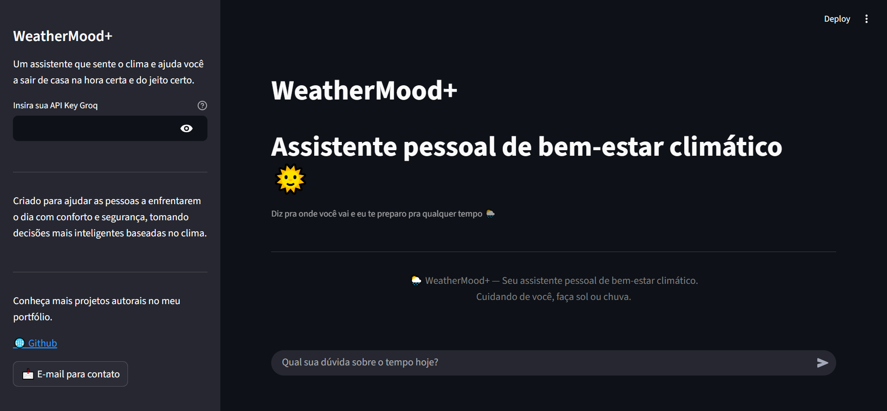
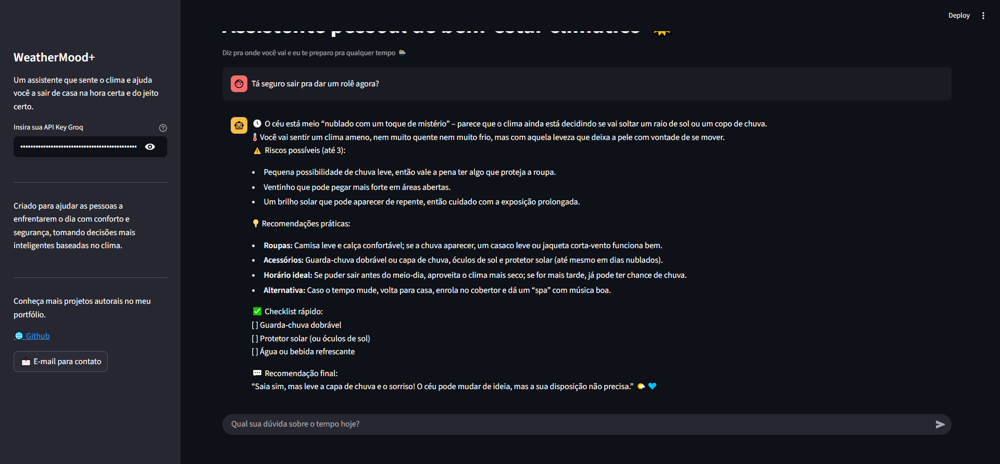

# 🌦️ WeatherMood+

Seu humor muda com o tempo — o meu também.  
Um assistente empático que sente o clima e ajuda você a sair de casa na hora certa e do jeito certo.

  
  
  

---

## 🧭 Sobre o Projeto

WeatherMood+ é um assistente pessoal de **bem-estar climático** desenvolvido em Python + Streamlit, com integração à **API Groq**.  
Ele não apenas descreve o tempo — ele interpreta o clima e suas emoções, guiando você com **empatia, leveza e humor**.

- ☀️ Se está ensolarado, ele te anima.  
- 🌧️ Se está chovendo, ele te cuida.  
- 🌬️ Se está frio, ele te protege.  
- ⛈️ Se o tempo fechou, ele te avisa com carinho (e firmeza!).

---

## 🌈 Funcionalidades Principais

- ✅ Analisa o clima (real ou estimado) e orienta o usuário sobre como se preparar.  
- ✅ Muda de personalidade e tom emocional conforme o tempo.  
- ✅ Sugere roupas, acessórios e melhores horários para sair.  
- ✅ Exibe um checklist rápido pra não esquecer nada.  
- ✅ Interface intuitiva e leve com Streamlit.

---

## 🛠️ Tecnologias Utilizadas

| Tecnologia       | Descrição                                    |
|-----------------|-----------------------------------------------|
| Python          | Lógica principal e estrutura do assistente    |
| Streamlit       | Interface de chat interativa                  |
| Groq API        | Geração de respostas de IA                    |
| UTF-8 Encoding  | Suporte completo a emojis e acentuação        |
| HTML/CSS        | Customização do layout dentro do Streamlit    |

---

## ⚙️ Instalação e Execução

### 1️⃣ Clone o repositório
git clone https://github.com/fehiarita/weathermoodAI.git

cd weathermoodAI

### 2️⃣ Instale as dependências
pip install -r requirements.txt

### 3️⃣ Crie sua chave de API Groq
[Gerar chave Groq](https://console.groq.com/keys)

### 4️⃣ Execute o projeto
streamlit run hia_assistente.py

### 5️⃣ Insira sua chave da Groq na barra lateral e comece o uso ☁️

## 🖼️ Exemplos de Tela

### Tela Inicial

  

### Exemplo de Resposta

  

### 🧑‍💻Autora

Feito com ☀️ e ☕ por Fernanda Hiarita

📩 Contato: nandahiarita.15@gmail.com

